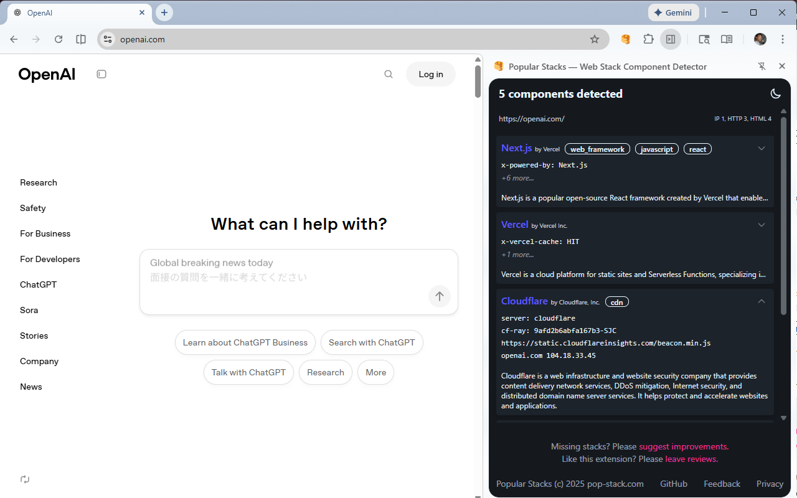

# Popular Stacks

## Overview

Popular Stacks is Google Chrome extension that tells users what frameworks, libraries, servers, and
other web technologies are used to build the current web page they're viewing. By analyzing the
current HTML content, HTTP headers, and IP addresses, it provides insights into its underlying
technology stack.



## Features

-   **Comprehensive Technology Detection**: Identifies a wide range of technologies including
    frontend frameworks, CSS libraries, analytics tools, web servers, CDNs, and cloud platforms.
-   **Multiple Detection Methods**:
    1. HTML content scanning for specific tags, scripts, or keywords.
    2. HTTP header analysis for server signatures and framework-specific headers.
    3. IP address analysis to identify hosting providers.
-   **Detailed Information**: Provides descriptions and official links for each detected technology.
-   **Configurable**: The detection logic is driven by simple JSON files, making it easy to maintain
    and add new technologies.
-   **Near-zero performance overhead**: Analysis starts only after user clicks the action button.
-   **Privacy-focused**: All analysis is performed locally. Uses no external service.

## Technology Detection

Popular Stacks detects a variety of technologies across different categories. Here's a summary based
on the current configuration:

 Category       | Examples
--------------- | -------------------------------------------------------------
Web Frameworks  | Angular, React, Vue.js, Next.js, Nuxt, Django, HTMX, jQuery
CSS Frameworks  | TailwindCSS, daisyUI, Chakra UI
HTTP Servers    | Nginx, Apache, Varnish, Envoy
Analytics       | Google Analytics, Google Tag Manager
CDN & Cloud     | AWS, GCP, Cloudflare, Vercel, Heroku, Azure, Akamai, Fastly
CMS             | WordPress, Drupal

## Config Data Format

Popular Stacks uses a set of JSON files in the `config/` directory. These files contain collections
of technology definitions, each with a set of rules for detection.

Each technology entry of `stacks.json` can have the following detection patterns:

-   `selectors`: An array of querySelector patterns to match against the current web page's DOM.
-   `html`: An array of regular expressions to match against the current web page's HTML source.
-   `headers`: An array of regular expressions to match against the HTTP response header fields.

```json
    "angular": {
        "name": "Angular",
        "description": "Angular is a comprehensive, open-source web application framework...",
        "tags": [
            "web_framework",
            "javascript",
            "typescript"
        ],
        "link": "https://angular.dev/",
        "developer": "Google LLC",
        "selectors": [
            "script[src*='angular']",
            "[ng-version]",
            "[ng-app-id]",
            "router-outlet",
            "#ng-state"
        ],
        "html": [
            "_ngcontent-ng"
        ],
        "headers": [
            "\\bangular"
        ]
    },
```

IP address information is loaded separately from JSON files in the `config/` directory (e.g.,
`ip-aws.json`). Different files contain lists of IP ranges for different cloud providers.

When analyzing a page, Popular Stacks's content script (`content.js`) scans the HTML. The service
workder script (`background.js`) inspects HTTP response headers and the server's IP address,
checking them against the patterns defined in the configuration files to find matches.


## Chrome Extension Architecture

### Source files

- **manifest.json**: The manifest for the Chrome extension.
- **background.js**: Service worker that install listeners, HTTP header detection via the
  `webRequest` API, and message routing between components. It's the entry point and is the central
  hub for state management.
- **content.js**: Content script injected into web pages to analyze the HTML text and DOM for
  technology patterns. It also fetches the current web page to obtain HTTP response headers and IP
  address and passes the headers to the background script.
- **sidepanel.js**: The script for the side panel UI that runs when the sidepanel HTML is loaded.
  It sends messages to the content script to initiate analysis. It also receives results from the
  background script and renders them.
- **sidepanel.html/css**: The HTML and CSS for the side panel interface.
- **utils.js**: Utility functions used across the extension.
- **config/**: Contains JSON files with detection patterns and rules for various technologies and
  cloud providers.

### The background script

One of the key design choices of this Chrome extension is the use of
[`activeTab` permission](https://developer.chrome.com/docs/extensions/develop/concepts/activeTab).
It grants the extension temporary access to the current active tab's content. Thanks to the
`activeTab` permission, this extension doesn't require broad `"<all_urls>"` host permission while
enabling users to inspect arbitrary web pages.

`chrome.action.onClicked` listener in `background.js` is the entry point and is the most important
function of the extension. When the action button is clicked, the listner does the following jobs:

1. Injects the content script to the current page.
2. Registeres `webRequest.onCompleted` listener. Although it targets arbitrary http urls, it's
   actually called back only for the current host as permitted by `activeTab`.
3. Creates a new sidepanel instance for the current tab.

These need to be done synchronously as `activeTab` permission is effective only during the execution
of the `onClick` listener.


### The Sidepanel script

Another key design choice is the use of
[sitepanel](https://developer.chrome.com/docs/extensions/reference/api/sidePanel) for the user
interface. While it's more common to use a popup with
[page action](https://developer.chrome.com/docs/extensions/reference/api/action), it has the size
restriction of 800x600 pixels and can be dismissed a little too easily. The side panel enables the
bigger and easier to use user interface.

We create a new side panel instance for each tab. A user can open the side panel on multiple tabs in
multiple windows simultaneously. The stateful information is held by the sidepanel script and
HTML. The background script and content script don't keep any stateful information.

The sidepanel script sends `fetchAndAnalyzeHtml` message to the content script to initiate the
actual analysis. This ensures that the sidepanel is already opened when the analysis results are
obtained. If we start analysis immediately after content script injection, the sidepanel may not be
ready yet.

Currently Chrome extension API provides no method to programmatically close the side panel.
This extension works around it by disabling the sidepanel for the active tab. This is why the side
panel doesn't close with smooth animation.

The user interface is styled with **daisyUI** which is a CSS framework based on TailwindCSS.

### The content script
In order to minimize the impact to browsing performance, this Chrome extension injects the content
script programmatically only when the action button is clicked.

The content script fetches the current page url using the Fetch API (`fetch()` function). This is
necessary to obtain HTTP response headers and IP address for analysis. Since we use `activeTab`
permission rather than `"<all_urls>"` host permissions, it's not possible to see HTTP response
headers of the current page before the user clicks the action button. The result of the fetch is
observed by `webRequest.onComplete` handler in the background script.

Note that we can directly fetch the current page in the background script's `action.onClick`
listener. As far as I tested, however, IP address information is available only if fetch is
initiated from the content script.


### Technology Detection Patterns

-   **HTML-based detection**: `content.js` uses the `detectHtmlComponents` function to find
    technologies by looking for specific patterns, keywords, and attributes within the HTML of the
    page.
-   **Header-based detection**: `background.js` uses `detectTechnologiesFromHeaders` to identify
    technologies based on the server, x-powered-by, and other HTTP response headers.
-   **IP-based detection**: `background.js` uses `detectIp` to determine the hosting provider (AWS,
    GCP, etc.) from the server's IP address by comparing it against known IP ranges loaded from the
    `config/` directory.

Both background script and content script load `stacks.json` file to obtain the detection patterns.
We can embed all HTML patterns in the content script if we want to optimize it, but this approach
seems performant enough.

### Development Tips

Since this is a Chrome extension without a build process, development is done manually by loading
the extension in Chrome developer mode:

-   Navigate to `chrome://extensions`
-   Enable "Developer mode"
-   Click "Load unpacked" and select this repository folder

Click Reload button if you change the background script.

Changess to the content script and the sidepanel `.js`, `.html`, or `.css` files are reflected
just by visiting a new page and/or re-opening the sidepanel.

`chrome://extensions` provides entry points to inspect the service worker and sidepanel views using
the Chrome developer tools. You can right-click the sidepanel html and inspect the extension code
too.

## License

Copyright 2025 pop-stack.com

Licensed under the Apache License, Version 2.0 (the "License");
you may not use this file except in compliance with the License.
You may obtain a copy of the License at

    http://www.apache.org/licenses/LICENSE-2.0

Unless required by applicable law or agreed to in writing, software
distributed under the License is distributed on an "AS IS" BASIS,
WITHOUT WARRANTIES OR CONDITIONS OF ANY KIND, either express or implied.
See the License for the specific language governing permissions and
limitations under the License.
